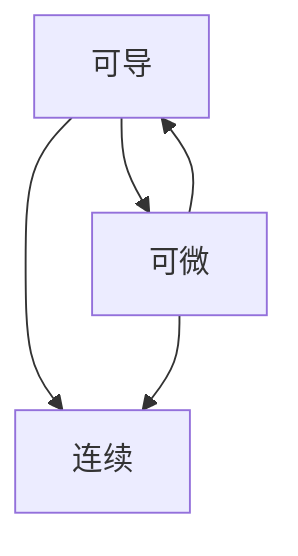
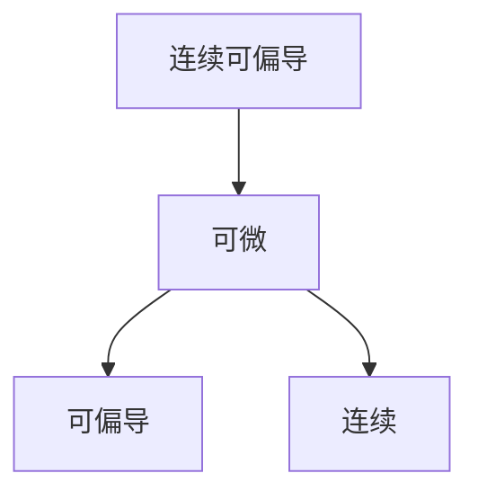

[toc]

# 一、初等数学

## 1.1 因式分解

$ (a \pm b)^2 = a^2 \pm 2ab + b^2 $

$ a^2 - b^2 = (a+b)(a-b) $

$ a^3 \pm b^3 = (a \pm b)(a^2 \mp ab + b^2) $

## 1.2 三角函数

$ \sin 2x = 2 \sin x \cos x $

$ \cos 2x = \cos^2 x - \sin^2 x = 2\cos^2 x - 1 = 1 - 2\sin^2 x $

# 二、高等数学

## 2.1 函数、极限、连续

### 2.1.1 连续

$ \lim \limits_{x \to x_0} f(x) = f(x_0) $

### 2.1.2 极限

$ \lim \limits_{x\to0}\frac{\sin x}x=1 $

$ \lim\limits_{x\to0}(1+x)^\frac1x=e $

$ \lim \limits_{x\to\infin}\sqrt[n]n = 1 $

$ x^y=e^{y\ln x} $

### 2.1.3 $ x\to0 $时的等价无穷小

$ \sin x\sim\tan x\sim\arcsin x\sim\arctan x\sim\ln(1+x)\sim(e^x-1)\sim x $

$ 1-\cos x\sim\frac12x^2 $

$ (1+x)^a-1\sim ax $

$ \arctan x=x-\frac{x^3}3+\frac{x^5}5+o(x^6) $

$ \tan x=x+\frac13x^3+\frac2{15}x^5+o(x^6) $

$ \arcsin x=x+\frac{x^3}6+\frac3{40}x^5+o(x^6) $

### 2.1.4 数列极限

- $ \lim\limits_{n\to\infin}\frac1n\sum\limits_{i=1}^{kn}f(\frac in)=\int_0^kf(x)dx $
- 夹逼准则

## 2.2 一元函数微分学

### 2.2.1 导数

$ f'(x_0) = \lim \limits_{x \to x_0} \frac {f(x) - f(x_0)}{x - x_0} $

### 2.2.2 常用微分公式：

- $ dC = 0 $
- $ dx^\alpha = \alpha x^{\alpha-1}dx $
- $ da^x = a^x \ln a \, dx $
- $ d\log_a^x = \frac {dx}{x \ln a} $
- $ d\sin x = \cos x dx $
- $ d\cos x = -\sin x \, dx $
- $ d\tan x = \sec^2 x \, dx $
- $ d\cot x = -\csc^2 x \, dx $
- $ d\sec x = \sec x \tan x \, dx $
- $ d\csc x = -\csc x \cot x \, dx $
- $ d\arcsin x = \frac {dx}{\sqrt {1 - x^2}} $
- $ d\arctan x = \frac {dx}{1 + x^2} $
- $ duv = udv + vdu $
- $ d\frac vu = \frac {udv - vdu}{u^2} $
- $ \left(\frac1{ax+b}\right)^{(n)}=\frac{(-1)^nn!a^n}{(ax+b)^{n+1}} $
- $ (\sin x)^{(n)}=\sin(x+\frac{n\pi}2) $
- $ (\cos x)^{(n)}=\cos(x+\frac{n\pi}2) $

### 2.2.3 连续、可导、可微的关系

### 2.2.4 渐进线

#### 2.2.4.1 水平渐进线

$ \lim\limits_{x\to+\infin}f(x)=b_1 $

$ \lim\limits_{x\to-\infin}f(x)=b_2 $

#### 2.2.4.2 铅直渐进线

$ \lim\limits_{x\to x_0^+}f(x)=\infin $

$ \lim\limits_{x\to x_0^-}f(x)=\infin $

#### 2.2.4.3 斜渐进线

$ y=ax+b $

$ \lim\limits_{x\to+\infin}\frac{f(x)}x=a\and\lim\limits_{x\to+\infin}(f(x)-ax)=b $

### 2.2.5 曲率

**曲率**：$ k=\frac{|y''|}{(1+y'^2)^{3/2}} $

**曲率半径**：$ R = \frac1k $

### 2.2.6 拉格朗日中值定理

$ f(x)\in C[a,b],f'(x) $在$ (a,b) $可导

$ \exist\xi\in(a,b),f'(\xi)=\frac{f(b)-f(a)}{b-a} $

$ f(b)-f(a)=f'(\xi)(b-a)=f'(a+(b-a)\theta)(b-a)\quad(0<\theta<1) $

- 辅助函数：$ F(x)=f(x)-f(a)-\frac{f(x)-f(a)}{b-a}(x-a) $

**应用场景**

- $ f(b)=f(a),\frac{f(b)-f(a)}{b-a},f(a)\ne f(b) $

- $ f(a)-f(b)-f(c) $

- $ f\Rarr f' $

### 2.2.7 柯西中值定理

$ f(x),g(x)\in C[a,b],f(x),g(x) $在$ (a,b) $可导$ ,g'(x)\ne0 $

$ \exist\xi\in(a,b),\frac{f'(\xi)}{g'(\xi)}=\frac{f(b)-f(a)}{g(b)-g(a)} $

- 辅助函数：$ F(x)=f(x)-f(a)-\frac{f(b)-f(a)}{F(b)-F(a)}[F(x)-F(a)] $

### 2.2.8 泰勒中值定理

$ f(x)=\sum\limits_{n=0}^\infin\frac{f^{(n)}(x_0)}{n!}(x-x_0)^n $

**皮亚诺余项**：$ o((x-x_0)^n) $

**拉格朗日余项**：$ \frac{f^{(n+1)}(\xi)}{(n+1)!}(x-x_0)^{n+1} $

**麦克劳林公式**：$ x_0=0 $

**应用场景**：

- $ x_0\begin{cases}f'(c)\cdots&x_0=c\\x_0=\frac{a+b}2\end{cases} $
- $ x\begin{cases}f(a)-f(b)&x=a,x=b\\\text{端点}\end{cases} $
- $ \begin{cases}f(a),f(b),f(c)&\text{2Lagrange}\\f'(a),f'(b),f'(c)&\text{2Lagrange}\\f(a),f'(c),f(b)&\text{2Taylor}\begin{cases}f(a)=f(c)+\cdots\\f(b)=f(c)+\cdots\end{cases}\end{cases} $

## 2.3 一元函数积分学

### 2.3.1 常用不定积分公式

- $ \int x^\alpha dx = \frac 1{\alpha+1}x^{\alpha+1}+C$
- $ \int\frac1xdx = \ln x + C $
- $ \int\alpha^xdx = \frac 1{\ln a}a^x + C$
- $ \int\cos xdx = \sin x + C $
- $ \int\sin xdx = -\cos x + C $
- $ \int\sec xdx = \ln \left|\sec x+\tan x\right| + C $
- $ \int\csc xdx = \ln\left|\csc x-\cot x\right| + C $
- $ \int\tan xdx = -\ln\left|\cos x\right| + C $
- $ \int\cot xdx = \ln\left|\sin x\right| + C $
- $ \int\sec^2xdx = \tan x + C $
- $ \int\csc^2x = -\cot x + C $
- $ \int\frac1{a^2+x^2}dx=\frac1a\arctan\frac xa + C $
- $ \int\frac1{a^2-x^2}dx=\frac1{2a}\ln\left|\frac{a+x}{a-x}\right| + C $
- $ \int\frac1{\sqrt{a^2-x^2}}dx=\arcsin\frac xa + C $
- $ \int\frac1{\sqrt{x^2\pm a^2}}dx=\ln\left|x+\sqrt{x^2\pm a^2}\right| + C $
- $ \int udv = uv-\int vdu $
- $ \int[f(x)+f'(x)]e^xdx=f(x)e^x+C$

### 2.3.2 万能代换公式

$ \sin x = \frac{2t}{1+t^2} $

$ \cos x=\frac{1-t^2}{1+t^2} $

$ \tan x=\frac{2t}{1+t^2} $

$ dx=\frac2{1+t^2}dt $

### 2.3.3 $ \Gamma $函数

#### 2.3.3.1 定义

$ \Gamma(\alpha) = \int _0^{+\infin} x^{\alpha-1}e^{-x}dx $

#### 2.3.3.2 计算

$ \Gamma(\alpha + 1) = \alpha \Gamma(\alpha) $
$ \Gamma(n + 1) = n! $
$ \Gamma(\frac 12) = \sqrt \pi $

### 2.3.4 华莱士公式

$ \int_0^\frac\pi2\sin^nxdx=\int_0^\frac\pi2\cos^nxdx=\begin{cases}\frac{n-1}n\cdot\frac{n-3}{n-2}\cdots\frac12\cdot\frac\pi2&\text n为偶数,\\\frac{n-1}n\cdot\frac{n-3}{n-2}\cdots\frac23\cdot1&\text n为奇数\end{cases} $

### 2.3.5 定积分公式

$ \int_0^\pi xf(\sin x)dx=\frac\pi2\int_0^\pi f(\sin x)dx $

$ \int_{-a}^af(x)dx=\int_0^af(x)+f(-x)dx $

$ \int_0^{\frac\pi2}f(\sin x)dx=\int_0^{\frac\pi2}f(\cos x)dx $

$ \int_0^\pi f(\sin x)dx=2\int_0^{\frac\pi2}f(\sin x)dx $

**积分中值定理**：$ \int_a^bf(x)dx=f(\xi)(b-a) $

**积分第一中值定理**：$ \int_a^bf(x)g(x)dx=f(\xi)\int_a^bg(x)dx $

### 2.3.6 不等式

**柯西不等式**：$ (\int_a^bf(x)g(x)dx)^2\le\int_a^bf^2(x)dx\int_a^bg^2(x)dx $

$ \left|\int_a^bf(x)dx\right|\le\int_a^b\left|f(x)\right|dx $

### 2.3.7 反常积分

$ \int_a^{+\infin}f(x)dx $

**比较审敛法**

$ 0\le f(x)\le g(x)\Rarr\begin{cases}\int_a^{+\infin}g(x)dx收敛\Rarr\int_a^{+\infin}f(x)dx收敛\\\int_a^{+\infin}f(x)dx发散\Rarr\int_a^{+\infin}g(x)dx发散\end{cases} $

$ f(x)\ge0,\exist M>0,p>1使得f(x)\le\frac M{x^p}\Rarr\int_a^{+\infin}f(x)dx收敛 $

$ f(x)\ge0,\exist M>0,0<p\le1使得f(x)\ge\frac M{x^p}\Rarr\int_a^{+\infin}f(x)dx收敛 $

$ f(x)\ge0,\exist p>1使得\lim\limits_{x\to+\infin}x^pf(x)=A\Rarr\int_a^{+\infin}f(x)dx收敛 $

$ f(x)\ge0,\exist0<p\le1,使得\lim\limits_{x\to+\infin}x^pf(x)=\begin{cases}A>0\\+\infin\end{cases}\Rarr\int_a^{+\infin}f(x)dx发散 $

---

$ \int_a^bf(x)dx $

$ \lim\limits_{x\to b^-}(b-x)^pf(x)=A\Rarr\begin{cases}p<1&收敛\\p\ge1&发散\end{cases} $

$ \lim\limits_{x\to a^+}(x-a)^pf(x)=A\Rarr\begin{cases}p<1&收敛\\p\ge1&发散\end{cases} $

### 2.3.8 定积分应用

#### 2.3.8.1 旋转体体积

$ V=\pi\int_\alpha^\beta[y_2^2(x)-y_1^2(x)]dx\quad绕x轴 $

$ V=2\pi\int_\alpha^\beta x(y_2(x)-y_1(x))dx\quad绕y轴 $

#### 2.3.8.2 旋转曲面面积

$ S=2\pi\int_\alpha^\beta\left|y\right|\sqrt{1+f'^2(x)}dx $

$ S=2\pi\int_\alpha^\beta\left|y(t)\right|\sqrt{x'^2(t)+y'^2(t)}dt $

## 2.4 向量代数与空间解析几何

### 2.4.1 向量代数

**模**：$ |\boldsymbol a|==\sqrt{x^2+y^2+z^2} $

**方向角与方向余弦**：$(\cos\alpha,\cos\beta,\cos\gamma)=(\frac x{|\boldsymbol r|},\frac y{|\boldsymbol r|},\frac z{|\boldsymbol r|})=e_r$

- $ \cos^2\alpha+\cos^2\beta+\cos^2\gamma=1 $

**数量积**：$\boldsymbol a\cdot\boldsymbol b=|\boldsymbol a||\boldsymbol b|\cos\theta=x_1x_2+y_1y_2$

- $ \boldsymbol a\perp\boldsymbol b\lrArr\boldsymbol a\cdot\boldsymbol b=0 $

**向量积**：$\boldsymbol a\times\boldsymbol b=\begin{vmatrix}\boldsymbol i&\boldsymbol j&\boldsymbol k\\a_x&a_y&a_z\\b_x&b_y&b_z\end{vmatrix}$

- $\boldsymbol a\times\boldsymbol b=-(\boldsymbol b\times\boldsymbol a)$
- $ \boldsymbol a\parallel\boldsymbol b\lrArr\boldsymbol a\times\boldsymbol b=0 $

**混合积**：$[\boldsymbol a\boldsymbol b\boldsymbol c]=(\boldsymbol a\times\boldsymbol b)\cdot\boldsymbol c=\begin{vmatrix}a_x&a_y&a_z\\b_x&b_y&b_z\\c_x&c_y&c_z\end{vmatrix}$

- $\boldsymbol a,\boldsymbol b,\boldsymbol c共面\lrArr[\boldsymbol a\boldsymbol b\boldsymbol c]=0$

**投影**：$Prj_u\boldsymbol a=|\boldsymbol a|\cos\phi$

### 2.4.2 平面

**一般式方程**：$Ax+By+Cz+D=0$，法线$\boldsymbol n=\{A,B,C\}$

**点法式方程**：$A(x-x_0)+B(y-y_0)+C(z-z_0)=0$，法线$\boldsymbol n=\{A,B,C\}$

**截距式方程**：$\frac xa+\frac yb+\frac zc=1$

**点到平面距离公式**：$d=\frac{|Ax_0+By_0+Cz_0+D|}{\sqrt{A^2+B^2+C^2}}$

**平面束**：$ A_1x+B_1y+C_1z+D_1+\lambda(A_2x+B_2y+C_2z+D_2)=0 $

### 2.4.3 直线

**一般式方程**：$\begin{cases}A_1x+B_1y+C_1z+D_1=0\\A_2x+B_2y+C_2z+D_2=0\end{cases}$

**对称式方程**：$\frac{x-x_0}l=\frac{y-y_0}m=\frac{z-z_0}n$，方向向量$\boldsymbol s=\{l,m,n\}$

**参数式方程**：$\begin{cases}x=x_0+lt\\y=y_0+mt\\z=z_0+nt\end{cases}$，方向向量$\boldsymbol s=\{l,m,n\}$

**点到直线距离公式**：$d=\frac{|\{x_1-x_0,y_1-y_0,z_1-z_0\}\times\{l,m,n\}|}{\sqrt{l^2+m^2+n^2}}$

**不相交直线距离公式**：$d=\frac{[\boldsymbol s_1\boldsymbol s_2\overrightarrow{AB}]}{|\boldsymbol s_1\times\boldsymbol s_2|}$

### 2.4.4 旋转面

$\begin{cases}f(x,y)=0\\z=0\end{cases}$

绕$x$轴旋转：$f(x,\pm\sqrt{y^2+z^2})=0$

绕$y$轴旋转：$f(\pm\sqrt{x^2+z^2},y)=0$

### 2.4.5 柱面

准线$L\begin{cases}F(x,y,z)=0\\G(x,y,z)=0\end{cases}$，母线$\{l,m,n\}$：$\begin{cases}F(x_0,y_0,z_0)=0\\G(x_0,y_0,z_0)=0\\\frac{x-x_0}l=\frac{y-y_0}m=\frac{z-z_0}n\end{cases}$

准线$L\begin{cases}x=x(t)\\y=y(t)\\z=z(t)\end{cases}$，母线$\{l,m,n\}$：$\begin{cases}x=x(t)+ls\\y=y(t)+ms\\z=z(t)+ns\end{cases}$

**圆柱面**：$x^2+y^2=R^2$

**椭圆柱面**：$\frac{x^2}{a^2}+\frac{y^2}{b^2}=1$

**抛物柱面**：$y^2=2px$

### 2.4.6 曲面

**椭球面**：$\frac{x^2}{a^2}+\frac{y^2}{b^2}+\frac{z^2}{c^2}=1$

**单叶双曲面**：$ \frac{x^2}{a^2}+\frac{y^2}{b^2}-\frac{z^2}{c^2}=1 $

**双叶双曲面**：$-\frac{x^2}{a^2}-\frac{y^2}{b^2}+\frac{z^2}{c^2}=1$

**椭圆抛物面**：$\frac{x^2}{a^2}+\frac{y^2}{b^2}=2pz$

**双曲抛物面**：$\frac{x^2}{a^2}-\frac{y^2}{b^2}=2pz$

**锥面**：$\frac{x^2}{a^2}+\frac{y^2}{b^2}-\frac{z^2}{c^2}=0$

### 2.4.7 曲线

**参数式**：$\begin{cases}x=x(t)\\y=y(t)\\z=z(t)\end{cases}$

**一般式**：$\begin{cases}F(x,y,z)=0\\G(x,y,z)=0\end{cases}$

## 2.5 多元函数微分学

### 2.5.1 二元函数极限

**不存在**：$ x=0\\y\to0 $，$ y=kx\\x\to0 $，$ y=x^2\\x\to0 $

**存在**：

- 有理化
- 等价无穷小
- 一元函数
- 夹逼

### 2.5.2 连续、可偏导、可微的关系

**连续**：$ \lim\limits_{(x,y)\to(x_0,y_0)}f(x,y)=f(x_0,y_0) $

**可偏导**：$ \lim\limits_{y=y_0\\x\to x_0}\frac{f(x,y_0)-f(x_0,y_0)}{x-x_0}\exist $

**可微**：$ \lim\limits_{\Delta x\to x_0\\\Delta y\to y_0}\frac{f(x_0+\Delta x,y_0+\Delta y)-f(x_0,y_0)-f'_x(x_0,y_0)\Delta x-f'_y(x_0,y_0)\Delta y}{\rho}=0 $

$ \rho=\sqrt{(\Delta x)^2+(\Delta y)^2} $

### 2.5.3 无条件极值

$ A=f_{xx}''(x_0,y_0)\quad B=f_{xy}''(x_0,y_0)\quad C=f_{yy}''(x_0,y_0) $

$ AC-B^2\begin{cases}>0&有极值\begin{cases}A>0&极小值\\A<0&极大值\end{cases}\\<0&无极值\\=0&不确定\end{cases} $

### 2.5.4 条件极值

**拉格朗日乘数法**：

条件：$ \phi(x,y)=0 $

拉格朗日函数$ F(x,y,\lambda)=f(x,y)+\lambda\phi(x,y) $

令$ \begin{cases}\frac{\partial F}{\partial x}=0\\\frac{\partial F}{\partial y}=0\\\frac{\partial F}{\partial\lambda}=0\end{cases} $

### 2.5.5 方向导数与梯度

**方向导数**：$ \frac{\partial f}{\partial l}|_{(x_0,y_0)}=f_x'(x,y)\cos\alpha+f_y'(x,y)\cos\beta $

**梯度**：$ grad\,u(x,y)=\nabla u(x,y)=\frac{\partial u}{\partial x}i+\frac{\partial u}{\partial y}j $

$ \frac{\partial u}{\partial l}|_P=\nabla u|_P\cdot e_l $

## 2.6 多元函数积分学

### 2.6.1 各坐标系

$\iint\limits_Df(x,y)d\sigma\quad\iiint\limits_\Omega f(x,y,z)dV $

**直角坐标系**：$\int_a^bdx\int_{\phi_1(x)}^{\phi_2(x)}f(x,y)dy\quad\iint\limits_Ddxdy\int_{z_1(x,y)}^{z_2(x,y)}f(x,y,z)dz$

**极/柱坐标系**：$\int_\alpha^\beta d\theta\int_{\rho_1(\theta)}^{\rho_2(\theta)}f(\rho\cos\theta,\rho\sin\theta)\rho d\rho\quad\iiint\limits_\Omega f(r\cos\theta,r\sin\theta,z)rdrd\theta dz$

**球坐标**：$\iiint\limits_\Omega f(r\sin\phi\cos\theta,r\sin\phi\sin\theta,r\cos\phi)r^2\sin\phi drd\phi d\theta$

### 2.6.2 曲线积分

#### 2.6.2.1 第一类线积分

$ \int_{L(\widehat{AB})}f(x,y)ds=\int_{L(\widehat{BA})}f(x,y)ds $

**参数方程**

$ L:\begin{cases}x=x(t)\\y=y(t)\end{cases},\alpha\le t\le\beta\\\int_Lf(x,y)ds=\int_\alpha^\beta f(x(t),y(t))\sqrt{x'^2(t)+y'^2(t)}dt $

**直角坐标**

$ L:y=y(x),a\le x\le b\\\int_Lf(x,y)ds=\int_a^bf(x,y(x))\sqrt{1+y'^2(x)}dx $

**极坐标**

$ L:\rho=\rho(\theta),\alpha\le\theta\le\beta\\\int_Lf(x,y)ds=\int_\alpha^\beta f(\rho(\theta)\cos\theta,\rho(\theta)\sin\theta)\sqrt{\rho^2+\rho'^2}d\theta $

#### 2.6.2.2 第二类线积分

$ \int_{L(\widehat{AB})}Pdx+Qdy=-\int_{L(\widehat{BA})}Pdx+Qdy $

$ \int_LPdx+Qdy=\int_L(P\cos\alpha+Q\cos\beta)ds $

**参数方程**

$ L:\begin{cases}x=x(t)\\y=y(t)\end{cases},t\in[\alpha,\beta]\\\int_LPdx+Qdy=\int_\alpha^\beta[P(x(t),y(t))x'(t)+Q(x(t),y(t))y'(t)]dt $

**格林公式**

$ \oint_LPdx+Qdy=\iint\limits_D(\frac{\partial Q}{\partial x}-\frac{\partial P}{\partial y})dxdy $

#### 2.6.2.3 线积分路径无关的等价表述

- 线积分$ \int Pdx+Qdy $路径无关
- $ \oint_CPdx+Qdy=0 $
- $ \frac{\partial P}{\partial y}=\frac{\partial Q}{\partial x} $
- $ \exist F(x,y),P(x,y)dx+Q(x,y)dy=dF(x,y) $

#### 2.6.2.4 斯托克斯公式

$ \oint_LPdx+Qdy+Rdz=\iint\limits_\Sigma(\frac{\partial R}{\partial y}-\frac{\partial Q}{\partial z})dydz+(\frac{\partial P}{\partial z}-\frac{\partial R}{\partial x})dzdx+(\frac{\partial Q}{\partial x}-\frac{\partial P}{\partial y})dxdy $

$ \oint_LPdx+Qdy+Rdz=\iint\limits_\Sigma\begin{vmatrix}\cos\alpha&\cos\beta&\cos\gamma\\\frac\partial{\partial x}&\frac\partial{\partial y}&\frac\partial{\partial z}\\P&Q&R\end{vmatrix}dS $

### 2.6.3 曲面积分

#### 2.6.3.1 第一类面积分

$ \iint\limits_\Sigma f(x,y,z)dS=\iint\limits_{-\Sigma}f(x,y,z)dS $

**直角坐标**

$ \iint\limits_\Sigma f(x,y,z)dS=\iint\limits_Df(x,y,z(x,y))\sqrt{1+z_x'^2+z_y'^2}dxdy $

#### 2.6.3.2 第二类面积分

$ \iint\limits_\Sigma Pdydz+Qdzdx+Rdxdy=-\iint_{-\Sigma}Pdydz+Qdzdx+Rdxdy $

$ \iint\limits_\Sigma Pdydz+Qdzdx+Rdxdy=\iint\limits_\Sigma(P\cos\alpha+Q\cos\beta+R\cos\gamma)dS $

**直角坐标**

$ \Sigma:z=z(x,y)\\\iint\limits_\Sigma Pdydz+Qdzdx+Rdxdy=\pm\iint\limits_{D_{xy}}[P(x,y,z(x,y))(-\frac{\partial z}{\partial x})+Q(x,y,z(x,y))(-\frac{\partial z}{\partial y})+R(x,y,z(x,y))]dxdy $

**高斯公式**

$ \oiint\limits_\Sigma Pdydz+Qdzdx+Rdxdy=\iiint\limits_\Omega(\frac{\partial P}{\partial x}+\frac{\partial Q}{\partial y}+\frac{\partial R}{\partial z})dV $

### 2.6.4 场论

#### 2.6.4.1 梯度

Refer to [2.5.4](#grad)

#### 2.6.4.2 通量

$ \boldsymbol A=P\boldsymbol i+Q\boldsymbol j+R\boldsymbol k $

$ \Phi=\iint\limits_\Sigma Pdydz+Qdzdx+Rdxdy $

#### 2.6.4.3 散度 

$ div\,\boldsymbol A=\frac{\partial P}{\partial x}+\frac{\partial Q}{\partial y}+\frac{\partial R}{\partial z} $

#### 2.6.4.4 旋度

$ rot\boldsymbol A=\begin{vmatrix}\boldsymbol i&\boldsymbol j&\boldsymbol k\\\frac\partial{\partial x}&\frac\partial{\partial y}&\frac\partial{\partial z}\\P&Q&R\end{vmatrix} $

### 2.6.5 定积分的应用

|          |                             平面                             |                            空间体                            |                             曲线                             |                             曲面                             |
| :------: | :----------------------------------------------------------: | :----------------------------------------------------------: | :----------------------------------------------------------: | :----------------------------------------------------------: |
| 几何度量 |                   $ S=\iint\limits_Ddxdy $                   |                $ V=\iiint\limits_\Omega dv $                 |                        $ L=\int_Cds $                        |                 $ S=\iint\limits_\Sigma dS $                 |
|   质量   |              $ m=\iint\limits_D\rho(x,y)dxdy $               |           $ m=\iiint\limits_\Omega\rho(x,y,z)dv $            |                  $ m=\int_C\rho(x,y,z)ds $                   |            $ m=\iint\limits_\Sigma\rho(x,y,z)dS $            |
|   质心   | $ \bar x=\frac{\iint\limits_Dx\rho(x,y)dxdy}m\\\bar y=\frac{\iint\limits_Dy\rho(x,y)dxdy}m $ | $ \bar x=\frac{\iiint\limits_\Omega x\rho(x,y,x)dv}m\\\bar y=\frac{\iiint\limits_\Omega y\rho(x,y,x)dv}m\\\bar z=\frac{\iiint\limits_\Omega z\rho(x,y,x)dv}m $ | $ \bar x=\frac{\int_Cx\rho(x,y,z)ds}m\\\bar y=\frac{\int_Cy\rho(x,y,z)ds}m\\\bar z=\frac{\int_Cz\rho(x,y,z)ds}m $ | $ \bar x=\frac{\iint\limits_\Sigma x\rho(x,y,z)dS}m\\\bar y=\frac{\iint\limits_\Sigma y\rho(x,y,z)dS}m\\\bar z=\frac{\iint\limits_\Sigma z\rho(x,y,z)dS}m $ |
| 转动惯量 | $ I_x=\iint\limits_Dy^2\rho(x,y)d\sigma\\I_y=\iint\limits_Dx^2\rho(x,y)d\sigma $ | $ I_x=\iiint\limits_\Omega(y^2+z^2)\rho(x,y,z)dv\\I_y=\iiint\limits_\Omega(x^2+z^2)\rho(x,y,z)dv\\I_z=\iiint\limits_\Omega(x^2+y^2)\rho(x,y,z)dv $ | $ I_x=\int_C(y^2+z^2)\rho(x,y,z)ds\\I_y=\int_C(x^2+z^2)\rho(x,y,z)ds\\I_z=\int_C(x^2+y^2)\rho(x,y,z)ds $ | $ I_x=\iint\limits_\Sigma(y^2+z^2)\rho(x,y,z)dS\\I_y=\iint\limits_\Sigma(x^2+z^2)\rho(x,y,z)dS\\I_z=\iint\limits_\Sigma(x^2+y^2)\rho(x,y,z)dS $ |

$ ds=\sqrt{1+y'^2}dx $

$ dS=\sqrt{1+z_x'^2+z_y'^2}d\sigma $

**变力做功**

$ W=\int_{\widehat{AB}}Pdx+Qdy+Rdz $

**通量**

$ \Phi=\iint\limits_\Sigma Pdydz+Qdzdx+Rdxdy $

## 2.7 无穷级数

### 2.7.1 级数审敛准则

#### 2.7.1.1 必要条件

$ \lim\limits_{n\to\infin}u_n=0 $

#### 2.7.1.2 正项级数

**比较审敛法**

$ \lim\limits_{n\to\infin}\frac{u_n}{v_n}=l\Rarr\begin{cases}0<l<+\infin&\sum\limits_{n=1}^\infin u_n与\sum\limits_{n=1}^\infin v_n同敛散\\l=0&\sum\limits_{n=1}^\infin v_n收敛\rarr\sum\limits_{n=1}^\infin u_n收敛\\l=+\infin&\sum\limits_{n=1}^\infin v_n发散\rarr\sum\limits_{n=1}^\infin u_n发散\end{cases} $

**比值审敛法**

$ \lim\limits_{n\to\infin}\frac{u_{n+1}}{u_n}=\rho\Rarr\sum\limits_{n=1}^\infin u_n\begin{cases}收敛&\rho<1\\发散&\rho>1\\不确定&\rho=1\end{cases} $

**根值审敛法**

$ \lim\limits_{n\to\infin}\sqrt[n]{u_n}=\rho\Rarr\sum\limits_{n=1}^\infin u_n\begin{cases}收敛&\rho<1\\发散&\rho>1\\不确定&\rho=1\end{cases} $

**p级数**

$ \sum\limits_{n=1}^\infin\frac1{n^p}\begin{cases}收敛&p>1\\发散&p\le1\end{cases} $

**q级数**

$ \sum\limits_{n=1}^\infin aq^n\begin{cases}收敛,\frac a{1-q}&q<1\\发散&q\ge1\end{cases} $

$ \sum\limits_{n=1}^\infin a_n(a_n>0),\{a_n\}\downarrow,a_n=f(n)\\则\sum\limits_{n=1}^\infin a_n收敛\Leftrightarrow\int_1^{+\infin}f(x)dx收敛 $

#### 2.7.1.3 交错级数（牛顿-莱布尼茨准则）

$ \left.\begin{aligned}u_n\ge u_{n+1}\\\lim\limits_{n\to\infin} u_n=0\end{aligned}\right\}\Rarr\sum\limits_{n=1}^\infin(-1)^{n-1}u_n收敛 $

### 2.7.2 常用幂级数

$ e^x=\sum\limits_{n=0}^\infin\frac{x^n}{n!}\quad x\in(-\infin,+\infin) $

$ \sin x=\sum\limits_{n=0}^\infin\frac{(-1)^nx^{2n+1}}{(2n+1)!}\quad x\in(-\infin,+\infin) $

$ \cos x=\sum\limits_{n=0}^\infin\frac{(-1)^nx^{2n}}{(2n)!}\quad x\in(-\infin,+\infin) $

$ \ln(1+x)=\sum\limits_{n=1}^\infin\frac{(-1)^{n-1}x^n}n\quad x\in(-1,1] $

$ \frac1{1-x}=\sum\limits_{n=0}^\infin x^n\quad x\in(-1,1) $

$ \frac1{1+x}=\sum\limits_{n=0}^\infin(-1)^nx^n\quad x\in(-1,1) $

$ (1+x)^\alpha=\sum\limits_{n=0}^\infin\frac{\alpha!}{(\alpha-n)!n!}x^n\quad R=1 $

### 2.7.3 收敛半径

$ \lim\limits_{n\to\infin}\left|\frac{a_{n+1}}{a_n}\right|=\rho\Rarr\begin{cases}R=0&\rho=+\infin\\R=+\infin&\rho=0\\R=\frac1\rho&0<\rho<+\infin\end{cases} $

$ \lim\limits_{n\to\infin}\sqrt[n]{|a_n|}=\rho\Rarr\begin{cases}R=0&\rho=+\infin\\R=+\infin&\rho=0\\R=\frac1\rho&0<\rho<+\infin\end{cases} $

### 2.7.4 傅里叶级数

$ f(x)=\frac{a_0}2+\sum\limits_{n=1}^\infin(a_n\cos nx+b_n\sin nx) $

$ l=\frac T2 $

$ a_n=\begin{cases}\frac1l\int_{-l}^lf(x)\cos\frac{n\pi x}ldx,&一般\\0,&奇展开\\\frac2l\int_0^lf(x)\cos\frac{n\pi x}{l}dx,&偶展开\end{cases} $

$ b_n=\begin{cases}\frac1l\int_{-l}^lf(x)\sin\frac{n\pi x}ldx,&一般\\\frac2l\int_0^lf(x)\sin\frac{n\pi x}{l}dx,&奇展开\\0,&偶展开\end{cases} $

## 2.8 常微分方程

### 2.8.1 一阶方程

#### 2.8.1.1 可分离变量方程

$ \frac{dy}{dx}=f(x)g(y)\\\frac{dy}{g(y)}=f(x)dx\\\int\frac{dy}{g(y)}=\int f(x)dx $

#### 2.8.1.2 齐次方程

$ \frac{dy}{dx}=f(\frac yx)\\u=\frac yx,y=ux,\frac{dy}{dx}=u+x\frac{du}{dx}\\\frac{du}{f(u)-u}=\frac{dx}x $

#### 2.8.1.3 线性方程

$ \frac{dy}{dx}+P(x)y=Q(x)\\y=e^{-\int P(x)dx}(\int Q(x)e^{\int P(x)dx}dx+C) $

#### 2.8.1.4 伯努利方程

$ y'+p(x)y=Q(x)y^n\\y^{-n}y'+p(x)y^{1-n}=Q(x)\\u=y^{1-n}\\\frac1{1-n}\frac{du}{dx}+p(x)u=Q(x) $

### 2.8.2 可降阶微分方程

#### 2.8.2.1 $y^{(n)}=f(x)$

反复积分

#### 2.8.2.2 $y''=f(x,y')$

$ p=y',y''=\frac{dp}{dx}\\\frac{dp}{dx}=f(x,p) $

#### 2.8.2.3 $y''=f(y,y')$

$p=y',y''=\frac{dp}{dy}\frac{dy}{dx}=p\frac{dp}{dy}\\p\frac{dp}{dy}=f(y,p)$

### 2.8.3 高阶线性方程

#### 2.8.3.1 $ 2 $阶常系数齐次线性方程

$ y''+py'+qy=0 $

**特征方程**：$ r^2+pr+q=0 $

| 特征方程的根                           | 微分方程通解的对应项                          |
| -------------------------------------- | --------------------------------------------- |
| 单实根$r$                              | $Ce^{rx}$                                     |
| $ 2 $重实根$r$                         | $ e^{rx}(C_1+C_2x) $                          |
| 一对单重复根$r_{1,2}=\alpha\pm i\beta$ | $e^{\alpha x}(C_1\cos\beta x+C_2\sin\beta x)$ |

#### 2.8.3.2 常系数非齐次线性方程

$y''+py'+qy=f(x)$

##### 2.8.3.2.1 $f(x)=e^{\lambda x}P_m(x)$

$y^*=x^ke^{\lambda x}Q_m(x)$

##### 2.8.3.2.2 $f(x)=e^{\lambda x}[P_l(x)\cos\omega x+P_n(x)\sin\omega x]$

$y^*=x^ke^{\lambda x}[R_m^{(1)}(x)\cos\omega x+R_m^{(2)}(x)\sin\omega x]$

#### 2.8.3.3 欧拉方程

$x^ny^{(n)}+p_1x^{n-1}y^{(n-1)}+\cdots+p_ny=f(x)\\x=e^t,t=\ln x,\frac{dt}{dx}=\frac1x\\y'=\frac{dy}{dx}=\frac{dy}{dt}\frac{dt}{dx}=\frac1x\frac{dy}{dt}\\y''=\frac{d^2y}{dx^2}=\frac d{dx}(\frac1x\frac{dy}{dt})=-\frac1{x^2}\frac{dy}{dt}+\frac1x\frac d{dx}\frac{dy}{dt}=-\frac1{x^2}\frac{dy}{dt}+\frac1{x^2}\frac{d^2y}{dt^2}\\xy'=\frac{dy}{dt},x^2y''=\frac{d^2y}{dt^2}-\frac{dy}{dt}\\D=\frac d{dt},xy'=Dy,x^2y''=D^2y-Dy=D(D-1)y\\x^ky^{(k)}=D(D-1)\cdots(D-k+1)y $

# 三、线性代数

## 3.1 行列式

### 3.1.1 拉普拉斯展开

$ \begin{vmatrix}A&*\\O&B\end{vmatrix}=\begin{vmatrix}A&O\\*&B\end{vmatrix}=\begin{vmatrix}A\end{vmatrix}\cdot\begin{vmatrix}B\end{vmatrix} $

$ \begin{vmatrix}O&A\\B&*\end{vmatrix}=\begin{vmatrix}*&A\\B&O\end{vmatrix}=(-1)^{mn}\begin{vmatrix}A\end{vmatrix}\cdot\begin{vmatrix}B\end{vmatrix} $

### 3.1.2 范德蒙行列式

$ \begin{vmatrix}1&1&\cdots&1\\x_1&x_2&\cdots&x_n\\x_1^2&x_2^2&\cdots&x_3^2\\\vdots&\vdots&\quad&\vdots\\x_1^{n-1}&x_2^{n-1}&\cdots&x_n^{n-1}\end{vmatrix}=\prod\limits_{1\le i<j\le n}(x_i-x_j) $

### 3.1.3 行列式公式

$ \begin{vmatrix}A^T\end{vmatrix}=\begin{vmatrix}A\end{vmatrix} $

$ \begin{vmatrix}kA\end{vmatrix}=k^n\begin{vmatrix}A\end{vmatrix} $

$ \begin{vmatrix}AB\end{vmatrix}=\begin{vmatrix}A\end{vmatrix}\begin{vmatrix}B\end{vmatrix} $

$ \begin{vmatrix}A^*\end{vmatrix}=\begin{vmatrix}A\end{vmatrix}^{n-1} $

$ \begin{vmatrix}A^{-1}\end{vmatrix}=\begin{vmatrix}A\end{vmatrix}^{-1} $

### 3.1.4 代数余子式

$ A_{ij}=(-1)^{i+j}M_{ij} $

## 3.2 矩阵

### 3.2.1 矩阵公式

$ (A+B)^T=A^T+B^T $

$ (kA)^T=kA^T $

$ (AB)^T=B^TA^T $

$ (E+B)^n=E+B+B^2+\cdots+B^n $

### 3.2.2 伴随矩阵

$ AA^*=A^*A=\begin{vmatrix}A\end{vmatrix}E $

$ (A^*)^{-1}=(A^{-1})^*=\frac1{\begin{vmatrix}A\end{vmatrix}}A $

$ (A^*)^T=(A^T)^* $

$ (kA)^*=k^{n-1}A^* $

$ \begin{vmatrix}A^*\end{vmatrix}=\begin{vmatrix}A\end{vmatrix}^{n-1} $

$ r(A^*)=\begin{cases}n&r(A)=n,\\1&r(A)=n-1,\\0&r(A)<n-1\end{cases} $

### 3.2.3 逆矩阵

$ A^{-1}=\frac1{\begin{vmatrix}A\end{vmatrix}}A^* $

$ \begin{bmatrix}B&O\\O&C\end{bmatrix}^{-1}=\begin{bmatrix}B^{-1}&O\\O&C^{-1}\end{bmatrix}$

$ \begin{bmatrix}O&B\\C&O\end{bmatrix}^{-1}=\begin{bmatrix}O&C^{-1}\\B^{-1}&O\end{bmatrix} $

### 3.2.4 秩

$ r\begin{pmatrix}A&O\\O&B\end{pmatrix}=r\begin{pmatrix}A\end{pmatrix}+r\begin{pmatrix}B\end{pmatrix} $

$ A可逆\Rarr r\begin{pmatrix}AB\end{pmatrix}=r\begin{pmatrix}BA\end{pmatrix}=r\begin{pmatrix}B\end{pmatrix} $

$ r(A)=r(AA^T)=r(A^T) $

$ r(kA)=r(A) $

$ r(A+B)\le r(A)+r(B)\le n(AB=O) $

$ r(AB)\le \min\{r(A),r(B)\} $

## 3.3 向量

### 3.3.1 线性表示的等价表述

- $ \beta\, $可由$ \alpha_1,\alpha_2,\cdots,\alpha_m $线性表示
- $ x_1\alpha_1+x_2\alpha_2+\cdots+x_m\alpha_m=\beta $有解
- $ A_{n\times m}X_{m\times1}=\beta $有解，$ A=(\alpha_1,\alpha_2,\cdots,\alpha_m) $
- $ r(\alpha_1,\alpha_2,\cdots,\alpha_m)=r(\alpha_1,\alpha_2,\cdots,\alpha_m|\beta) $

### 3.3.2 线性相关的等价表述

- $ \alpha_1,\alpha_2,\cdots,\alpha_m $线性相关
- $ x_1\alpha_1+x_2\alpha_2+\cdots+x_m\alpha_m=0 $有非零解
- $ A_{n\times m}X_{m\times1}=0 $有非零解，$ A=(\alpha_1,\alpha_2,\cdots,\alpha_m) $
- $ r(\alpha_1,\alpha_2,\cdots,\alpha_m)<m $

### 3.3.3 *Schmidt*正交化

$ \alpha_1,\alpha_2,\alpha_3 $线性无关

1. $ \beta_1=\alpha_1\\\beta_2=\alpha_2-\frac{(\alpha_2,\beta_1)}{(\beta_1,\beta_1)}\beta_1 \\\beta_3=\alpha_3-\frac{(\alpha_3,\beta_1)}{(\beta_1,\beta_1)}\beta_1-\frac{(\alpha_3,\beta_2)}{(\beta_2,\beta_2)}\beta_2\\ $
2. $\gamma_1=\frac{\beta_1}{\Vert\beta_1\Vert}\quad\gamma_2=\frac{\beta_2}{\Vert\beta_2\Vert}\quad\gamma_3=\frac{\beta_3}{\Vert\beta_3\Vert}$

### 3.3.4 基变换

**过渡矩阵**：$ (\beta_1,\beta_2,\cdots,\beta_r)=(\alpha_1,\alpha_2,\cdots,\alpha_r)P_{r\times r} $

**坐标变换**：$ X=PY $

## 3.4 线性方程组

解向量个数$ \,=n-r(A) $

### 3.4.1 齐次方程组$ Ax=0 $

$ \begin{vmatrix}A\end{vmatrix}=0\Rarr $方程有非零解

**通解**：$ x=k_1\eta_1+k_2\eta_2+\cdots+k_{n-r(A)}\eta_{n-r(A)} $

### 3.4.2 非齐次方程组$ Ax=b $

$ r(A)\ne r(B)\Rarr $方程无解

$ r(A)=r(B)=n\Rarr $方程有唯一解

$ r(A)=r(B)<n\Rarr $方程有无穷多解

**通解**：$ x = \alpha+k_1\eta_1+\cdots+k_{n-r(A)}\eta_{n-r(A)} $

## 3.5 特征值

### 3.5.1 定义

$ A\alpha=\lambda\alpha $

**特征值**：$\lambda$

**特征向量**：$\alpha$

**特征矩阵**：$\lambda E-A$

**特征方程**：$\begin{vmatrix}\lambda E-A\end{vmatrix}=0$

### 3.5.2 性质

$ A=[a_{ij}]_{n\times n} $

$ \sum\limits_{i=1}^n\lambda_i=tr(A)=\sum\limits_{i=1}^na_{ii} $

$ \prod\limits_{i=1}^n\lambda_i=\begin{vmatrix}A\end{vmatrix} $

不同特征值的特征向量线性无关

<table border="1">
    <tr>
        <th>矩阵</th>
        <td>A</td>
        <td>kA</td>
        <td>Ak</td>
        <td>f(A)</td>
        <td>A-1</td>
        <td>A*</td>
        <td>P-1AP</td>
        <td>A-1+f(A)</td>
    </tr><tr>
    	<th>特征值</th>
    	<td>&lambda;</td>
    	<td>k&lambda;</td>
    	<td>&lambda;k</td>
    	<td>f(&lambda;)</td>
    	<td>&lambda;-1</td>
    	<td>|A|&frasl;&lambda;</td>
    	<td>&lambda;</td>
    	<td>1&frasl;&lambda;+f(&lambda;)</td>
    </tr><tr>
    	<th>特征向量</th>
    	<td>&alpha;</td>
    	<td>&alpha;</td>
    	<td>&alpha;</td>
    	<td>&alpha;</td>
    	<td>&alpha;</td>
    	<td>&alpha;</td>
    	<td>P-1&alpha;</td>
    	<td>&alpha;</td>
    </tr>
</table>

### 3.5.3 相似

$ A\sim B\, $**定义**：$ P^{-1}AP=B $

$ A\sim B\Rarr\begin{cases}|\lambda E-A|=|\lambda E-B|\\r(A)=r(B)\\A,B有相同特征值\\|A|=|B|=\prod\limits_{i=1}^n\lambda_i\\tr(A)=tr(B)=tr(\Lambda)\end{cases} $

### 3.5.4 实对称矩阵的性质

- 不同**特征值**的**特征向量**相互正交
- 实对称矩阵必相似对角阵，且存在正交阵$Q,Q^{-1}AQ=Q^TAQ=\Lambda$

### 3.5.5 相似对角化

#### 3.5.5.1 等价表述

- $n$阶矩阵$A$可对角化
- $A$有$n$个线性无关特征向量

#### 3.5.5.2 相似对角化步骤

1. 求出特征值与特征向量
3. 施密特正交化
4. 令$Q=(\gamma_{11},\gamma_{12}\dotsb)$

$ Q^{-1}AQ=Q^TAQ=\Lambda=diag[\lambda_1,\lambda_2,\cdots,\lambda_n] $

### 3.5.6 正交矩阵

$AA^T=E$

$A^T=A^{-1}$

## 3.6 二次型

### 3.6.1 定义

**标准型**：只有平方项

**规范型**：标准型且系数只有$\pm1,0$

**正定**：对任意$x,f>0$

### 3.6.2 正交变换

$x=Qy$

$ f(x_1,x_2,\cdots,x_n)=x^TAx=y^TQ^TAQy=\lambda_1y_1^2+\lambda_2y_2^2+\cdots+\lambda_ny_n^2 $

### 3.6.3 合同

$ A\simeq B\, $**定义**：$ Q^TAQ=B$

$ r(A)=r(B) $

### 3.6.4 正定的等价表述

- $f(x_1,x_2,\cdots,x_n)=x^TAx$正定
- $A$的正惯性系数$p=r=n$
- $A\simeq E$
- $A=D^TD$
- $A$的全部特征值$>0$
- $A$的顺序主子式$>0$

**必要条件**

- $a_{ii}>0$
- $|A|>0$

# 四、概率论与数理统计

## 4.1 随机事件和概率

### 4.1.1 条件概率

$ P(B|A)=\frac{P(AB)}{P(A)} $

**独立**：$ P(AB)=P(A)P(B) $

### 4.1.2 公式

$ A-B=A\overline B $

$ P(A\cup B)=P(A)+P(B)-P(AB) $

$ P(A\cup B\cup C)=P(A)+P(B)+P(C)-P(AB)-P(AC)-P(BC)+P(ABC) $

$ P(A-B)=P(A)-P(AB) $

$ P(AB)=P(A)P(B|A) $

**全概率公式**：$ P(A)=\sum\limits_{i=1}^nP(B_i)P(A|B_i) $

**贝叶斯公式**：$ P(B_j|A)=\frac{P(B_j)P(A|B_j)}{\sum\limits_{i=1}^nP(B_i)P(A|B_i)} $

## 4.2 随机变量及其概率分布

### 4.2.1 分布函数

$ F(x)=P\{X\le x\} $

#### 4.2.1.1 离散型

**分布律**：$ P\{X=x_k\}=p_k $

- $\sum\limits_{k=1}^{+\infin}p_k=1$
- $ p_k\ge0 $

#### 4.2.1.2 连续型

**概率密度函数**：$f(x)$

- $ f(x)\ge0 $
- $ \int_{-\infin}^{+\infin}f(x)dx=1 $

$ F(x)=\int_{-\infin}^xf(t)dt $

$F'(x)=f(x)$

**充要条件**：$F(-\infin)=0,F(+\infin)=1$，单调不减，右连续

### 4.2.2 常用分布

|    分布     |  参数   |         分布律/概率密度         | 数学期望 |   方差   |
| :---------: | :-----: | :-----------------------------: | :------: | :------: |
| $(0-1)$分布 | $0<p<1$ | $P\{X=k\}=p^k(1-p)^{1-k},k=0,1$ |   $p$    | $p(1-p)$ |
|  二项分布$X\sim B(n,p) $  |    $n\ge1\\0<p<1$    | $P\{X=k\}=C_n^kp^k(1-p)^{n-k},k=0,1,\cdots,n$ | $np$ | $np(1-p)$ |
| 几何分布 | $0<p<1 $ | $ P\{X=k\}=(1-p)^{k-1}p,k=1,2,\cdots $ | $\frac1p$ | $\frac{1-p}{p^2}$ |
| 超几何分布 | $ N.M,n\\(M\le N)\\(n\le N) $ | $ P\{X=k\}=\frac{C_M^kC_{N-M}^{n-k}}{C_N^k},k\in \Z,\max\{0,n-N+M\}\le k\le\min\{n,M\} $ | $\frac{nM}N$ | $ \frac{nM}N(1-\frac MN)(\frac{N-n}{N-1}) $ |
| 泊松分布$X\sim P(\lambda)$ | $\lambda>0$ | $P\{X=k\}=\frac{\lambda^k}{k!}e^{-\lambda},k=0,1,\cdots$ | $\lambda $ | $ \lambda $ |
| 均匀分布$X\sim U(a,b)$ | $a<b $ | $ f(x)=\begin{cases}\frac1{b-a}&a<x<b\\0&otherwise\end{cases} $ | $ \frac{a+b}2 $ | $ \frac{(b-a)^2}{12} $ |
| 指数分布$X\sim E(\lambda) $ | $ \lambda>0 $ | $ f(x)=\begin{cases}\lambda e^{-\lambda x}&x>0\\0&x\le0\end{cases} $ | $ \frac1\lambda $ | $ \frac1{\lambda^2} $ |
| 正态分布$X\sim N(\mu,\sigma^2)$ | $\mu\\\sigma>0$ | $ f(x)=\frac1{\sqrt{2\pi}\sigma}e^{-\frac{(x-\mu)^2}{2\sigma^2}} $ | $\mu $ | $\sigma^2 $ |

$ n>100 $时，$B(n,p)\approx P(np)$

**无记忆性**：$ X\sim P(\lambda)\Rarr P\{X>t+s|X>s\}=P\{X>t\} $

$ X\sim N(\mu,\sigma^2) $

- $ F(x)=\Phi(\frac{x-\mu}\sigma) $
- $ \Phi(-x)=1-\Phi(x),\Phi(0)=\frac12 $
- $X\sim N(0,1),P\{|X|<a\}=2\Phi(x)-1$

$ \int_{-\infin}^{+\infin}e^{-x^2}dx=\sqrt\pi $

### 4.2.3 随机变量函数的分布

**离散型**：$ P\{Y=g(x_k)\}=p_k $

**连续型**：$ F_Y(y)=P\{Y\le y\}=P\{g(X)\le y\}=\int_{g(x)\le y}f_X(x)dx\\f_Y(y)=F'_Y(y) $

## 4.3 多维随机变量及其分布

### 4.3.1 定义

$ F(x,y)=P\{X\le x,Y\le y\} $

**边缘分布**：$ F_X(x)=P\{X\le x\}=P\{X\le x,Y\le+\infin\}=F(x,+\infin)\\F_Y(y)=P\{Y\le y\}=P\{X\le+\infin,Y\le y\}=F(+\infin,y) $

**条件分布**：$ F_{X|Y}(x|y)=P\{X\le x|Y=y\}\\F_{Y|X}(y|x)=P\{Y\le y|X=x\} $

- $ F(-\infin,y)=F(x,-\infin)=F(-\infin,-\infin)=0 $
- $ F(+\infin,+\infin)=1 $

#### 4.3.1.1 离散型

$ P\{X=x_i|Y=y_j\}=\frac{P\{X=x_i,Y=y_j\}}{P\{Y=y_j\}} $

#### 4.3.1.2 连续型

$ F(x,y)=\int_{-\infin}^x\int_{-\infin}^yf(u,v)dudv $

$ P\{(x,y)\in D\}=\iint\limits_Df(x,y)dxdy $

**边缘密度**：$ f_X(x)=\int_{-\infin}^{+\infin}f(x,y)dy\\f_Y(y)=\int_{-\infin}^{+\infin}f(x,y)dx $

**条件密度**：$ f_{X|Y}(x|y)=\frac{f(x,y)}{f_Y(y)}\\f_{Y|X}(y|x)=\frac{f(x,y)}{f_X(x)} $

### 4.3.2 独立性

$ P\{X=x_i,Y=y_j\}=P\{X=x_i\}P\{Y=y_j\} $

$ f(x,y)=f_X(x)f_Y(y) $

### 4.3.3 二维分布

#### 4.3.3.1 均匀分布

$ f(x,y)=\begin{cases}\frac1A&(x,y)\in G\\0&otherwise\end{cases} $

#### 4.3.3.2 正态分布

$ f(x,y)=\frac1{2\pi\sigma_1\sigma_2\sqrt{1-\rho^2}}e^{-\frac1{2(1-\rho^2)}\left(\frac{(x-\mu_1)^2}{\sigma_1^2}-\frac{2\rho(x-\mu_1)(y-\mu_2)}{\sigma_1\sigma_2}+\frac{(y-\mu_2)^2}{\sigma_2^2}\right)} $

$ (X,Y)\sim N(\mu_1,\mu_2,\sigma_1^2,\sigma_2^2,\rho) $

- $ X\sim N(\mu_1,\sigma_1^2)\quad Y\sim N(\mu_2,\sigma_2^2) $
- $X$与$Y$正态且相互独立$ \lrArr\rho=0 $
- $ \begin{vmatrix}a&b\\c&d\end{vmatrix}\ne0\Rarr(aX+bY,cX+dY) $服从二维正态分布

### 4.3.4 两个随机变量函数的分布

$ Z=g(X,Y) $

$ F_Z(z)=P\{Z\le z\}=P\{f(X,Y)\le z\}=\iint\limits_{g(x,y)\le z}f(x,y)dxdy $

## 4.4 随机变量的数字特征

### 4.4.1 数学期望

$ E(X)=\sum\limits_{k=1}^{+\infin}x_kp_k $

$ E(X)=\int_{-\infin}^{+\infin}xf(x)dx $

- $ E(CX+Y)=CE(X)+E(Y) $
- $ E(C)=C $
- $ E(XY)=E(X)E(Y) $

#### 4.4.1.1 $ Y=g(X) $

$ E(Y)=\sum\limits_{k=1}^{+\infin}g(x_k)p_k $

$ E(Y)=\int_{-\infin}^{+\infin}g(x)f(xdx) $

#### 4.4.1.2 $ Z=g(X,Y) $

$ E(Z)=\sum\limits_{i=1}^{+\infin}\sum\limits_{j=1}^{+\infin}g(x_i,y_j)p_{ij} $

$ E(Z)=\int_{-\infin}^{+\infin}\int_{-\infin}^{+\infin}g(x,y)f(x,y)dxdy $

### 4.4.2 方差

$ D(X)=E\{[X-E(X)]^2\}=E(X^2)-[E(X)]^2 $

- $ D(C)=0 $
- $ D(aX+b)=a^2D(X) $
- $ D(X\pm Y)=D(X)+D(Y)\pm2Cov(X,Y) $

### 4.4.3 矩

**$k$阶原点矩**：$ E(X^k) $

**$k$阶中心距**：$ E\{[X-E(X)]^k\} $

**$k+l$阶混合矩**：$ E(X^kY^l) $

**$k+l$阶混合中心矩**：$ E\{[X-E(X)]^k[Y-E(Y)]^l\} $

### 4.4.4 协方差

$ Cov(X,Y)=E\{[X-E(X)][Y-E(Y)]\}=E(XY)-E(X)E(Y) $

- $ Cov(X,Y)=Cov(Y,X) $
- $ Cov(aX,bY)=abCov(X,Y) $
- $ Cov(X_1+X_2,Y)=Cov(X_1,Y)+Cov(X_2,Y) $

### 4.4.5 相关系数

$ \rho_{XY}=\begin{cases}\frac{Cov(X,Y)}{\sqrt{D(X)}\sqrt{D(Y)}}&D(X)D(Y)\ne0\\0&D(X)D(Y)=0\end{cases} $

- $ |\rho_{XY}|\le1 $

- $X$，$Y$不相关$ \lrArr\rho_{XY}=0$
- $X$，$Y$独立$\Rarr X$，$Y$不相关

## 4.5 大数定律和中心极限定律

### 4.5.1 切比雪夫不等式

$ P\{|X-E(X)|\ge\epsilon\}\le\frac{D(X)}{\epsilon^2} $

### 4.5.2 依概率收敛

$ \lim\limits_{x\to+\infin}P\{|X_n-A|<\epsilon\}=1 $

$ X_n\xrightarrow{P}A $

### 4.5.3 切比雪夫大数定律

$ X_1,X_2,\cdots,X_n,\cdots $两两不相关

$ \lim\limits_{n\to\infin}P\left\{\left|\frac1n\sum\limits_{i=1}^nX_i-\frac1n\sum\limits_{i=1}^nE(X_i)\right|<\epsilon\right\}=1 $

### 4.5.4 列维-林德伯格中心极限定律

$ X_1,X_2,\cdots,X_n,\cdots $独立同分布

$ \lim\limits_{n\to\infin}P\left\{\frac{\sum\limits_{i=1}^nX_i-n\mu}{\sqrt{n}\sigma}\le x\right\}=\Phi(x) $

### 4.5.5 略

**伯努利大数定律**：$ X_n\sim B(n,p) $

**辛钦大数定律**：独立同分布

**棣莫弗-拉普拉斯中心极限定律**：$ X_n\sim B(n,p) $

## 4.6 数理统计

### 4.6.1 样本数字特征

**样本均值**：$ \bar{X}=\frac1n\sum\limits_{i=1}^nX_i $

**样本方差**：$ S^2=\frac1{n-1}\sum\limits_{i=1}^n(X_i-\bar{X})^2 $

$ E(\bar{X})=E(X)=\mu $

$ D(\bar{X})=\frac1nD(X)=\frac{\sigma^2}n $

$ E(S^2)=D(X)=\sigma^2 $

### 4.6.2 常用抽样分布

|                 分布                  |                             定义                             |    参数     |       数学期望        |                       方差                        |
| :-----------------------------------: | :----------------------------------------------------------: | :---------: | :-------------------: | :-----------------------------------------------: |
| $ \chi^2 $分布$ \chi^2\sim\chi^2(n) $ |     $ X_i\sim N(0,1)\\\chi^2=X_1^2+X_2^2+\cdots+X_n^2 $      |  $ n\ge1 $  |         $ n $         |                      $ 2n $                       |
|        $ t $分布$ T\sim t(n) $        |    $ X\sim N(0,1),Y\sim\chi^2(n)\\T=\frac X{\sqrt{Y/n}} $    |  $ n\ge1 $  |         $ 0 $         |                 $ \frac n{n-2} $                  |
|               $ F $分布               | $ X\sim\chi^2(n_1),Y\sim\chi^2(n_2)\\F=\frac{X/n_1}{Y/n_2} $ | $ n_1,n_2 $ | $ \frac{n_2}{n_2-2} $ | $ \frac{2n_2^2(n_1+n_2-2)}{n_1(n_2-2)^2(n_2-4)} $ |

$ P\{\chi^2>\chi_\alpha^2(n)\}=\alpha $

$ \chi^2_1\sim\chi^2(n_1),\chi_2^2\sim\chi(n_2)\Rarr\chi_1^2+\chi_2^2\sim\chi^2(n_1+n_2) $

---

$ P\{T>t_\alpha(n)\}=\alpha $

$ P\{|T|>t_{\alpha/2}(n)\}=\alpha $

$ t_{1-\alpha}(n)=-t_\alpha(n) $

---

$ P\{F>F_\alpha(n_1,n_2)\}=\alpha $

$ \frac1F\sim F(n_2,n_1) $

$ F_{1-\alpha}(n_1,n_2)=\frac1{F_\alpha(n_2,n_1)} $

### 4.6.3 正态整体抽样分布

$ X\sim N(\mu,\sigma^2) $

- $ \bar X\sim N(\mu,\frac{\sigma^2}n),U=\frac{\bar X-\mu}{\sigma/\sqrt n}\sim N(0,1) $
- $ \chi^2=\frac{(n-1)S^2}{\sigma^2}\sim\chi^2(n-1) $
- $ T=\frac{\bar X-\mu}{S/\sqrt n}\sim t(n-1) $
- $ \chi^2=\frac1{\sigma^2}\sum\limits_{i=1}^n(X_i-\mu)^2\sim\chi^2(n) $

$ X\sim N(\mu_1,\sigma_1^2),Y\sim N(\mu_2,\sigma_2^2) $

- $ \bar X-\bar Y\sim N(\mu_1-\mu_2,\frac{\sigma_1^2}{n_1}+\frac{\sigma_2^2}{n_2}),U=\frac{(\bar X-\bar Y)-(\mu_1-\mu_2)}{\sqrt{\frac{\sigma_1^2}{n_1}+\frac{\sigma_2^2}{n_2}}}\sim N(0,1) $
- $ \sigma_1^2=\sigma_2^2\Rarr T=\frac{\bar X-\bar Y-(\mu_1-\mu_2)}{S_\omega\sqrt{\frac1{n_1}+\frac1{n_2}}}\sim t(n_1+n_2-2)\\S_\omega=\sqrt{\frac{(n_1-1)S_1^2+(n_2-1)S_2^2}{n_1+n_2-2}} $
- $ F=\frac{S_1^2/\sigma_1^2}{S_2^1/\sigma_2^2}\sim F(n_1-1,n_2-1) $

## 4.7 参数估计

### 4.7.1 点估计

**无偏性**：$ E(\hat\theta)=\theta $

**有效性**：$ D(\hat\theta_1)\le D(\hat\theta_2) $

**相合性**：$ \lim\limits_{n\to\infin}P\{|\hat\theta-\theta|<\epsilon\}=1 $

### 4.7.2 矩估计

**样本矩**：$ A_l=\frac1n\sum\limits_{i=1}^nX_i^l $

1. 令$ \begin{cases}\mu_1=E(X^1)=\mu\\\mu_2=E(X^2)=D(X)+[E(X)]^2=\sigma^2+\mu^2\end{cases} $
2. 解得$ \begin{cases}\theta_1=\theta_1(\mu_1,\mu_2)\\\theta_2=\theta_2(\mu_1,\mu_2)\end{cases} $
3. 以$ A_1,A_2 $代替$ \mu_1,\mu_2 $得$ \begin{cases}\hat\theta_1=\theta_1(A_1,A_2)\\\hat\theta_2=\theta_2(A_1,A_2)\end{cases} $

- $ \frac1n\sum\limits_{i=1}^nX_i^2-\bar X=\frac1n\sum\limits_{i=1}^n(X_i-\bar X)^2 $

### 4.7.3 最大似然估计

1. 分布律$ P\{X=x\}=p(x;\theta) $
2. 似然函数$ L(\theta)=\prod\limits_{i=1}^np(x_i;\theta) $
3. 令$ \frac{dL(\theta)}{d\theta}=0 $或$ \frac{d\ln L(\theta)}{d\theta}=0 $或$ \begin{cases}\frac{\partial L(\theta)}{\partial\theta_1}=0\\\frac{\partial L(\theta)}{\partial\theta_2}=0\end{cases} $
4. 解得$ \begin{cases}\hat\theta_1\\\hat\theta_2\end{cases} $

### 4.7.4 区间估计

|                           未知参数                           |                     $ 1-\alpha $置信区间                     |
| :----------------------------------------------------------: | :----------------------------------------------------------: |
|                          $ \sigma $                          | $ \left(\frac{(n-1)S^2}{\chi^2_{\frac\alpha2}(n-1)},\frac{(n-1S^2)}{\chi^2_{\frac\alpha2}(n-1)}\right) $ |
|                   $ \mu $($ \sigma $未知)                    | $ \left(\bar X-t_{\frac\alpha2}(n-1)\frac{S}{\sqrt n},\bar X+t_{\frac\alpha2}(n-1)\frac{S}{\sqrt n}\right) $ |
|                   $ \mu $($ \sigma $已知)                    | $ \left(\bar X-u_{\frac\alpha2}\frac\sigma{\sqrt n},\bar X+u_{\frac\alpha2}\frac\sigma{\sqrt n}\right) $ |
|              $ \frac{\sigma_1^2}{\sigma_2^2} $               | $ \left(\frac{S_1^2}{S_2^2}\frac1{F_{\frac\alpha2}(n_1-1,n_2-1)},\frac{S_1^2}{S_2^2}F_{\frac\alpha2}(n_2-1,n_1-1)\right) $ |
|          $ \mu_1-\mu_2 $($ \sigma_1,\sigma_2 $已知)          | $ \left(\bar X-\bar Y-u_{\frac\alpha2}\sqrt{\frac{\sigma_1^2}{n_1}+\frac{\sigma_2^2}{n_2}},\bar X-\bar Y+u_{\frac\alpha2}\sqrt{\frac{\sigma_1^2}{n_1}+\frac{\sigma_2^2}{n_2}}\right) $ |
| $ \mu_1-\mu_2 $($ \sigma_1,\sigma_2 $未知，$ \sigma_1=\sigma_2 $) | $ \left(\bar X-\bar Y-t_{\frac\alpha2}(n_1+n_2-2)S_w\sqrt{\frac1{n_1}+\frac1{n_1}},\bar X-\bar Y+t_{\frac\alpha2}(n_1+n_2-2)S_w\sqrt{\frac1{n_1}+\frac1{n_2}}\right) $ |

$ S_w=\sqrt{\frac{(n_1-1)S_1^2+(n_2-1)S_2^2}{n_1+n_2-2}} $

## 4.8 假设检验

### 4.8.1 显著性检验一般步骤

1. 提出原假设$ H_0 $
2. 给出显著性水平$ \alpha(0<\alpha<1) $
3. 确定检验统计量及拒绝域形式
4. 求拒绝域$ W $
5. 按样本值计算检验统计量$ T $的观测值$ t $
6. 当$ t\in W $时拒绝原假设$ H_0 $ 

### 4.8.2 正态总体参数的假设检验

|                           检验参数                           |                         假设$ H_0 $                          |                         假设$ H_1 $                          |                          检验统计量                          | $ H_0 $为真时的分布 |                            拒绝域                            |
| :----------------------------------------------------------: | :----------------------------------------------------------: | :----------------------------------------------------------: | :----------------------------------------------------------: | :-----------------: | :----------------------------------------------------------: |
|                  $ \mu $($ \sigma^2 $已知)                   |           $ \mu=\mu_0\\\mu\le\mu_0\\\mu\ge\mu_0 $            |            $ \mu\ne\mu_0\\\mu>\mu_0\\\mu<\mu_0 $             |          $ U=\frac{\bar X-\mu_0}{\sigma/\sqrt{n}} $          |     $ N(0,1) $      |  $ |U|\ge u_{\frac\alpha2}\\U\ge u_\alpha\\U\le -u_\alpha $  |
|                  $ \mu $($ \sigma^2 $未知)                   |           $ \mu=\mu_0\\\mu\le\mu_0\\\mu\ge\mu_0 $            |            $ \mu\ne\mu_0\\\mu>\mu_0\\\mu<\mu_0 $             |             $ T=\frac{\bar X-\mu_0}{S/\sqrt n} $             |     $ t(n-1) $      | $ |T|\ge t_{\frac\alpha2}(n-1)\\T\ge t_\alpha(n-1)\\T\le -t_\alpha(n-1) $ |
|                  $ \sigma^2 $($ \mu $已知)                   | $ \sigma^2=\sigma_0^2\\\sigma^2\le\sigma_0^2\\\sigma^2\ge\sigma_0^2 $ | $ \sigma^2\ne\sigma_0^2\\\sigma^2>\sigma_0^2\\\sigma^2<\sigma_0^2 $ | $ \chi^2=\frac1{\sigma_0^2}\sum\limits_{i=1}^n(X_i-\mu)^2 $  |    $ \chi^2(n) $    | $ \chi^2\le\chi_{1-\frac\alpha2}^2(n)\or\chi^2\ge\chi^2_{\frac\alpha2}(n)\\\chi^2\ge\chi^2_\alpha(n)\\\chi^2\le\chi^2_{1-\alpha}(n) $ |
|                  $ \sigma^2 $($ \mu $未知)                   | $ \sigma^2=\sigma_0^2\\\sigma^2\le\sigma_0^2\\\sigma^2\ge\sigma_0^2 $ | $ \sigma^2\ne\sigma_0^2\\\sigma^2>\sigma_0^2\\\sigma^2<\sigma_0^2 $ |            $ \chi^2=\frac{(n-1)S^2}{\sigma_0^2} $            |   $ \chi^2(n-1) $   | $ \chi^2\le\chi_{1-\frac\alpha2}^2(n-1)\or\chi^2\ge\chi^2_{\frac\alpha2}(n-1)\\\chi^2\ge\chi^2_\alpha(n-1)\\\chi^2\le\chi^2_{1-\alpha}(n-1) $ |
|        $ \mu_1-\mu_2 $($ \sigma_1^2,\sigma_2^2 $已知)        | $ \mu_1-\mu_2=\mu_0\\\mu_1-\mu_2\le\mu_0\\\mu_1-\mu_2\ge\mu_0 $ | $ \mu_1-\mu_2\ne\mu_0\\\mu_1-\mu_2>\mu_0\\\mu_1-\mu_2<\mu_0 $ | $ U=\frac{\bar X-\bar Y-\mu_0}{\sqrt{\frac{\sigma_1^2}{n_1}+\frac{\sigma_2^2}{n_2}}} $ |     $ N(0,1) $      |  $ |U|\ge u_{\frac\alpha2}\\U\ge u_\alpha\\U\le-u_\alpha $   |
| $ \mu_q-\mu_2 $($ \sigma_1^2,\sigma_2^2 $未知，$ \sigma_1^2=\sigma_2^2 $) | $ \mu_1-\mu_2=\mu_0\\\mu_1-\mu_2\le\mu_0\\\mu_1-\mu_2\ge\mu_0 $ | $ \mu_1-\mu_2\ne\mu_0\\\mu_1-\mu_2>\mu_0\\\mu_1-\mu_2<\mu_0 $ | $ T=\frac{\bar X-\bar Y-\mu_0}{S_w\sqrt{\frac1{n_1}+\frac1{n_2}}} $ |  $ t(n_1+n_2-2) $   | $ |T|\ge t_{\frac\alpha2}(n_1+n_2-2)\\T\ge t_\alpha(n_1+n_2-2)\\T\le-t_\alpha(n_1+n_2-2) $ |
|        $ \sigma_1^2=\sigma_2^2 $($ \mu_1,\mu_2 $已知)        | $ \sigma_1^2=\sigma_2^2\\\sigma_1^2\le\sigma_2^2\\\sigma_1^2\ge\sigma_2^2 $ | $ \sigma_1^2\ne\sigma_2^2\\\sigma_1^2>\sigma_2^2\\\sigma_1^2<\sigma_2^2 $ | $ F=\frac{n_2\sum\limits_{i=1}^{n_1}(X_i-\mu_1)^2}{n_1\sum\limits_{j=1}^{n_2}(X_j-\mu_2)^2} $ |   $ F(n_1,n_2) $    | $ F\le F_{1-\frac\alpha2}(n_1,n_2)\or F\ge F_{\frac\alpha2}(n_1,n_2)\\F\ge F_\alpha(n_1,n_2)\\F\le F_\alpha(n_1,n_2) $ |
|        $ \sigma_1^2=\sigma_2^2 $($ \mu_1,\mu_2 $未知)        | $ \sigma_1^2=\sigma_2^2\\\sigma_1^2\le\sigma_2^2\\\sigma_1^2\ge\sigma_2^2 $ | $ \sigma_1^2\ne\sigma_2^2\\\sigma_1^2>\sigma_2^2\\\sigma_1^2<\sigma_2^2 $ |                  $ F=\frac{S_1^2}{S_2^2} $                   | $ F(n_1-1,n_2-1) $  | $ F\le F_{1-\frac\alpha2}(n_1-1,n_2-1)\or F\ge F_{\frac\alpha2}(n_1-1,n_2-1)\\F\ge F_\alpha(n_1-1,n_2-1)\\F\le F_\alpha(n_1-1,n_2-1) $ |

$ S_w=\sqrt{\frac{(n_1-1)S_1^2+(n_2-1)S_2^2}{n_1+n_2-2}} $