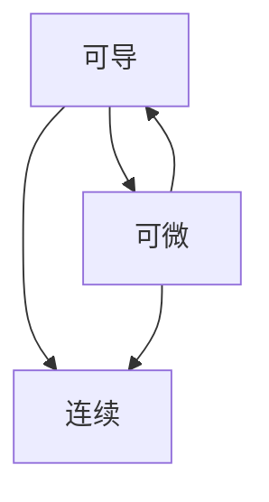
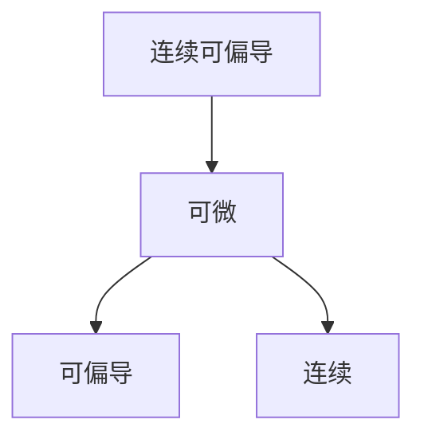

# 一、初等数学

## 1.1 因式分解

$ (a \pm b)^2 = a^2 \pm 2ab + b^2 $

$ a^2 - b^2 = (a+b)(a-b) $

$ a^3 \pm b^3 = (a \pm b)(a^2 \mp ab + b^2) $

## 1.2 三角函数

$ \sin 2x = 2 \sin x \cos x $

$ \cos 2x = \cos^2 x - \sin^2 x = 2\cos^2 x - 1 = 1 - 2\sin^2 x $

# 二、高等数学

## 2.1 函数、极限、连续

### 2.1.1 连续

$ \lim \limits_{x \to x_0} f(x) = f(x_0) $

### 2.1.2 极限

$ \lim \limits_{x\to0}\frac{\sin x}x=1 $

$ \lim\limits_{x\to0}(1+x)^\frac1x=e $

$ \lim \limits_{x\to\infin}\sqrt[n]n = 1 $

$ x^y=e^{y\ln x} $

### 2.1.3 $ x\to0 $时的等价无穷小

$ \sin x\sim\tan x\sim\arcsin x\sim\arctan x\sim\ln(1+x)\sim(e^x-1)\sim x $

$ 1-\cos x\sim\frac12x^2 $

$ (1+x)^a-1\sim ax $

## 2.2 一元函数微分学

### 2.2.1 导数

$ f'(x_0) = \lim \limits_{x \to x_0} \frac {f(x) - f(x_0)}{x - x_0} $

### 2.2.2 常用微分公式：

- $ dC = 0 $
- $ dx^\alpha = \alpha x^{\alpha-1}dx $
- $ da^x = a^x \ln a \, dx $
- $ d\log_a^x = \frac {dx}{x \ln a} $
- $ d\sin x = \cos x dx $
- $ d\cos x = -\sin x \, dx $
- $ d\tan x = \sec^2 x \, dx $
- $ d\cot x = -\csc^2 x \, dx $
- $ d\sec x = \sec x \tan x \, dx $
- $ d\csc x = -\csc x \cot x \, dx $
- $ d\arcsin x = \frac {dx}{\sqrt {1 - x^2}} $
- $ d\arctan x = \frac {dx}{1 + x^2} $
- $ duv = udv + vdu $
- $ d\frac vu = \frac {udv - vdu}{u^2} $

### 2.2.3 连续、可导、可微的关系

## 2.3 一元函数积分学

### 2.3.1 常用不定积分公式

- $ \int x^\alpha dx = \frac 1{\alpha+1}x^{\alpha+1}+C$
- $ \int\frac1xdx = \ln x + C $
- $ \int\alpha^xdx = \frac 1{\ln a}a^x + C$
- $ \int\cos xdx = \sin x + C $
- $ \int\sin xdx = -\cos x + C $
- $ \int\sec xdx = \ln \left|\sec x+\tan x\right| + C $
- $ \int\csc xdx = \ln\left|\csc x-\cot x\right| + C $
- $ \int\tan xdx = -\ln\left|\cos x\right| + C $
- $ \int\cot xdx = \ln\left|\sin x\right| + C $
- $ \int\sec^2xdx = \tan x + C $
- $ \int\csc^2x = -\cot x + C $
- $ \int\frac1{a^2+x^2}dx=\frac1a\arctan\frac xa + C $
- $ \int\frac1{a^2-x^2}dx=\frac1{2a}\ln\left|\frac{a+x}{a-x}\right| + C $
- $ \int\frac1{\sqrt{a^2-x^2}}dx=\arcsin\frac xa + C $
- $ \int\frac1{\sqrt{x^2\pm a^2}}dx=\ln\left|x+\sqrt{x^2\pm a^2}\right| + C $
- $ \int udv = uv-\int vdu $
- $ \int[f(x)+f'(x)]e^xdx=f(x)e^x+C$

### 2.3.2 万能代换公式

$ \sin x = \frac{2t}{1+t^2} $

$ \cos x=\frac{1-t^2}{1+t^2} $

$ \tan x=\frac{2t}{1+t^2} $

$ dx=\frac2{1+t^2}dt $

### 2.3.3 $ \Gamma $函数

#### 2.3.3.1 定义

$ \Gamma(\alpha) = \int _0^{+\infin} x^{\alpha-1}e^{-x}dx $

#### 2.3.3.2 计算

$ \Gamma(\alpha + 1) = \alpha \Gamma(\alpha) $
$ \Gamma(n + 1) = n! $
$ \Gamma(\frac 12) = \sqrt \pi $

### 2.3.4 华莱士公式

$ \int_0^\frac\pi2\sin^nxdx=\int_0^\frac\pi2\cos^nxdx=\begin{cases}\frac{n-1}n\cdot\frac{n-3}{n-2}\cdots\frac12\cdot\frac\pi2&\text n为偶数,\\\frac{n-1}n\cdot\frac{n-3}{n-2}\cdots\frac23\cdot1&\text n为奇数\end{cases} $

### 2.3.5 定积分公式

$ \int_0^\pi xf(\sin x)dx=\frac\pi2\int_0^\pi f(\sin x)dx $

$ f(b)-f(a)=\int_a^bf'(x)dx $

$ f(b)-f(a)=f'(\xi)(b-a)\quad(a<\xi<b) $

### 2.3.6 不等式

$ (\int_a^bf(x)g(x)dx)^2\le\int_a^bf^2(x)dx\int_a^bg^2(x)dx $

$ \left|\int_a^bf(x)dx\right|\le\int_a^b\left|f(x)\right|dx $

### 2.3.7 反常积分

$ \int_a^bf(x)dx $

$ \lim\limits_{x\to b^-}(b-x)^pf(x)=A\Rarr\begin{cases}p<1&收敛\\p\ge1&发散\end{cases} $

$ \lim\limits_{x\to a^+}(x-a)^pf(x)=A\Rarr\begin{cases}p<1&收敛\\p\ge1&发散\end{cases} $

$ \lim\limits_{x\to\pm\infin}x^pf(x)=A\Rarr\begin{cases}p>1&收敛\\p\le1&发散\end{cases} $

### 2.3.8 定积分应用

#### 2.3.8.1 弧长

$ s=\int_\alpha^\beta\sqrt{x'^2(t)+y'^2(t)}dt $

$ s=\int_\alpha^\beta\sqrt{1+y'^2(x)}dx $

$ s=\int_\alpha^\beta\sqrt{r^2(\theta)+r'^2(\theta)}d\theta $

#### 2.3.8.2 旋转体体积

$ V=\pi\int_\alpha^\beta[y_2^2(x)-y_1^2(x)]dx\quad绕x轴 $

$ V=2\pi\int_\alpha^\beta x(y_2(x)-y_1(x))dx\quad绕y轴 $

#### 2.3.8.3 旋转曲面面积

$ S=2\pi\int_\alpha^\beta\left|y\right|\sqrt{1+f'^2(x)}dx $

$ S=2\pi\int_\alpha^\beta\left|y(t)\right|\sqrt{x'^2(t)+y'^2(t)}dt $

## 2.4 向量代数与空间解析几何

## 2.5 多元函数微分学

### 2.5.1 连续、可偏导、可微的关系

### 2.5.2 无条件极值

$ A=f_{xx}''(x_0,y_0)\quad B=f_{xy}''(x_0,y_0)\quad C=f_{yy}''(x_0,y_0) $

$ AC-B^2\begin{cases}>0&有极值\begin{cases}A>0&极小值\\A<0&极大值\end{cases}\\<0&无极值\\=0&不确定\end{cases} $

### 2.5.3 条件极值

**拉格朗日乘数法**：

条件：$ \phi(x,y)=0 $

拉格朗日函数$ F(x,y,\lambda)=f(x,y)+\lambda\phi(x,y) $

令$ \begin{cases}\frac{\partial F}{\partial x}=0\\\frac{\partial F}{\partial y}=0\\\frac{\partial F}{\partial\lambda}=0\end{cases} $

### 2.5.4 方向导数与梯度

**方向导数**：$ \frac{\partial f}{\partial l}|_{(x_0,y_0)}=f_x'(x,y)\cos\alpha+f_y'(x,y)\cos\beta $

**梯度**：$ grad\,u(x,y)=\nabla u(x,y)=\frac{\partial u}{\partial x}i+\frac{\partial u}{\partial y}j $

$ \frac{\partial u}{\partial l}|_P=\nabla u|_P\cdot e_l $

## 2.6 多元函数积分学

## 2.7 无穷级数

### 2.7.1 级数审敛准则

#### 2.7.1.1 必要条件

$ \lim\limits_{n\to\infin}u_n=0 $

#### 2.7.1.2 正项级数

$ \lim\limits_{n\to\infin}\frac{u_n}{v_n}=l\Rarr\begin{cases}0<l<+\infin&\sum\limits_{n=1}^\infin u_n与\sum\limits_{n=1}^\infin v_n同敛散\\l=0&\sum\limits_{n=1}^\infin v_n收敛\rarr\sum\limits_{n=1}^\infin u_n收敛\\l=+\infin&\sum\limits_{n=1}^\infin v_n发散\rarr\sum\limits_{n=1}^\infin u_n发散\end{cases} $

$ \lim\limits_{n\to\infin}\frac{u_{n+1}}{u_n}=\rho\Rarr\sum\limits_{n=1}^\infin u_n\begin{cases}收敛&\rho<1\\发散&\rho>1\\不确定&\rho=1\end{cases} $

$ \lim\limits_{n\to\infin}\sqrt[n]{u_n}=\rho\Rarr\sum\limits_{n=1}^\infin u_n\begin{cases}收敛&\rho<1\\发散&\rho>1\\不确定&\rho=1\end{cases} $

$ \sum\limits_{n=1}^\infin\frac1{n^p}\begin{cases}收敛&p>1\\发散&p\le1\end{cases} $

$ \sum\limits_{n=1}^\infin aq^n\begin{cases}收敛,\frac a{1-q}&q<1\\发散&q\ge1\end{cases} $

#### 2.7.1.3 交错级数（牛顿-莱布尼茨准则）

$ \left.\begin{aligned}u_n\ge u_{n+1}\\\lim\limits_{n\to\infin} u_n=0\end{aligned}\right\}\Rarr\sum\limits_{n=1}^\infin(-1)^{n-1}u_n收敛 $

### 2.7.2 常用幂级数

$ e^x=\sum\limits_{n=0}^\infin\frac{x^n}{n!}\quad x\in(-\infin,+\infin) $

$ \sin x=\sum\limits_{n=0}^\infin\frac{(-1)^nx^{2n+1}}{(2n+1)!}\quad x\in(-\infin,+\infin) $

$ \cos x=\sum\limits_{n=0}^\infin\frac{(-1)^nx^{2n}}{(2n)!}\quad x\in(-\infin,+\infin) $

$ \ln(1+x)=\sum\limits_{n=1}^\infin\frac{(-1)^{n-1}x^n}n\quad x\in(-1,1] $

$ \frac1{1-x}=\sum\limits_{n=0}^\infin x^n\quad x\in(-1,1) $

$ \frac1{1+x}=\sum\limits_{n=0}^\infin(-1)^nx^n\quad x\in(-1,1) $

$ (1+x)^\alpha=\sum\limits_{n=0}^\infin\frac{\alpha!}{(\alpha-n)!n!}x^n\quad R=1 $

### 2.7.3 收敛半径

$ \lim\limits_{n\to\infin}\left|\frac{a_{n+1}}{a_n}\right|=\rho\Rarr\begin{cases}R=0&\rho=+\infin\\R=+\infin&\rho=0\\R=\frac1\rho&0<\rho<+\infin\end{cases} $

$ \lim\limits_{n\to\infin}\sqrt[n]{|a_n|}=\rho\Rarr\begin{cases}R=0&\rho=+\infin\\R=+\infin&\rho=0\\R=\frac1\rho&0<\rho<+\infin\end{cases} $

### 2.7.4 傅里叶级数

$ f(x)=\frac{a_0}2+\sum\limits_{n=1}^\infin(a_n\cos nx+b_n\sin nx) $

$ a_0=\frac1l\int_{-l}^lf(x)dx $

$ a_n=\frac1l\int_{-l}^lf(x)\cos\frac{n\pi x}ldx $

$ b_n=\frac1l\int_{-l}^lf(x)\sin\frac{n\pi x}ldx $

## 2.8 常微分方程

# 三、线性代数

## 3.1 行列式

### 3.1.1 拉普拉斯展开

$ \begin{vmatrix}A&*\\O&B\end{vmatrix}=\begin{vmatrix}A&O\\*&B\end{vmatrix}=\begin{vmatrix}A\end{vmatrix}\cdot\begin{vmatrix}B\end{vmatrix} $

$ \begin{vmatrix}O&A\\B&*\end{vmatrix}=\begin{vmatrix}*&A\\B&O\end{vmatrix}=(-1)^{mn}\begin{vmatrix}A\end{vmatrix}\cdot\begin{vmatrix}B\end{vmatrix} $

### 3.1.2 范德蒙行列式

$ \begin{vmatrix}1&1&\cdots&1\\x_1&x_2&\cdots&x_n\\x_1^2&x_2^2&\cdots&x_3^2\\\vdots&\vdots&\quad&\vdots\\x_1^{n-1}&x_2^{n-1}&\cdots&x_n^{n-1}\end{vmatrix}=\prod\limits_{1\le i<j\le n}(x_i-x_j) $

### 3.1.3 行列式公式

$ \begin{vmatrix}A^T\end{vmatrix}=\begin{vmatrix}A\end{vmatrix} $

$ \begin{vmatrix}kA\end{vmatrix}=k^n\begin{vmatrix}A\end{vmatrix} $

$ \begin{vmatrix}AB\end{vmatrix}=\begin{vmatrix}A\end{vmatrix}\begin{vmatrix}B\end{vmatrix} $

$ \begin{vmatrix}A^*\end{vmatrix}=\begin{vmatrix}A\end{vmatrix}^{n-1} $

$ \begin{vmatrix}A^{-1}\end{vmatrix}=\begin{vmatrix}A\end{vmatrix}^{-1} $

$ \begin{vmatrix}A\end{vmatrix}=\prod\limits_{i=1}^n\lambda_i $

$ A\sim B\Rarr\begin{vmatrix}A\end{vmatrix}=\begin{vmatrix}B\end{vmatrix} $

### 3.1.4 代数余子式

$ A_{ij}=(-1)^{i+j}M_{ij} $

## 3.2 矩阵

### 3.2.1 矩阵公式

$ (A+B)^T=A^T+B^T $

$ (kA)^T=kA^T $

$ (AB)^T=B^TA^T $

$ (E+B)^n=E+B+B^2+\cdots+B^n $

### 3.2.2 伴随矩阵

$ AA^*=A^*A=\begin{vmatrix}A\end{vmatrix}E $

$ (A^*)^{-1}=(A^{-1})^*=\frac1{\begin{vmatrix}A\end{vmatrix}}A $

$ (A^*)^T=(A^T)^* $

$ (kA)^*=k^{n-1}A^* $

$ \begin{vmatrix}A^*\end{vmatrix}=\begin{vmatrix}A\end{vmatrix}^{n-1} $

$ r(A^*)=\begin{cases}n&r(A)=n,\\1&r(A)=n-1,\\0&r(A)<n-1\end{cases} $

### 3.2.3 逆矩阵

$ A^{-1}=\frac1{\begin{vmatrix}A\end{vmatrix}}A^* $

$ \begin{bmatrix}B&O\\O&C\end{bmatrix}^{-1}=\begin{bmatrix}B^{-1}&O\\O&C^{-1}\end{bmatrix}$

$ \begin{bmatrix}O&B\\C&O\end{bmatrix}^{-1}=\begin{bmatrix}O&C^{-1}\\B^{-1}&O\end{bmatrix} $

### 3.2.4 秩

$ r\begin{pmatrix}A&O\\O&B\end{pmatrix}=r\begin{pmatrix}A\end{pmatrix}+r\begin{pmatrix}B\end{pmatrix} $

$ A可逆\Rarr r\begin{pmatrix}AB\end{pmatrix}=r\begin{pmatrix}BA\end{pmatrix}=r\begin{pmatrix}B\end{pmatrix} $

$ r(A)=r(AA^T)=r(A^T) $

$ r(kA)=r(A) $

$ r(A+B)\le r(A)+r(B)  $

$ AB=O\Rarr r(A)+r(B)\le n $

$ r(AB)\le \min\{r(A),r(B)\} $

## 3.3 向量

### 3.3.1 *Schmidt*正交化

$ \alpha_1,\alpha_2,\alpha_3 $线性无关

1. $ \beta_1=\alpha_1\\\beta_2=\alpha_2-\frac{(\alpha_2,\beta_1)}{(\beta_1,\beta_1)}\beta_1 \\\beta_3=\alpha_3-\frac{(\alpha_3,\beta_1)}{(\beta_1,\beta_1)}\beta_1-\frac{(\alpha_3,\beta_2)}{(\beta_2,\beta_2)}\beta_2\\ $
2. $\gamma_1=\frac{\beta_1}{|\beta_1|}\quad\gamma_2=\frac{\beta_2}{|\beta_2|}\quad\gamma_3=\frac{\beta_3}{|\beta_3|}$

## 3.4 线性方程组

解向量个数$ \,=n-r(A) $

### 3.4.1 齐次方程组$ Ax=0 $

$ \begin{vmatrix}A\end{vmatrix}=0\Rarr $方程有非零解

**通解**：$ x=k_1\eta_1+k_2\eta_2+\cdots+k_{n-r(A)}\eta_{n-r(A)} $

### 3.4.2 非齐次方程组$ Ax=b $

$ r(A)\ne r(\overline A)\Rarr $方程无解

$ r(A)=r(B)=n\Rarr $方程有唯一解

$ r(A)=r(B)<n\Rarr $方程有无穷多解

**通解**：$ x = \alpha+k_1\eta_1+\cdots+k_{n-r(A)}\eta_{n-r(A)} $

## 3.5 特征值

### 3.5.1 定义

$ A\alpha=\lambda\alpha $

**特征值**：$\lambda$

**特征向量**：$\alpha$

**特征矩阵**：$\lambda E-A$

**特征方程**：$\begin{vmatrix}\lambda E-A\end{vmatrix}=0$

### 3.5.2 性质

$ A=[a_{ij}]_{n\times n} $

$ \sum\limits_{i=1}^n\lambda_i=\sum\limits_{i=1}^na_{ii} $

$ \prod\limits_{i=1}^n\lambda_i=\begin{vmatrix}A\end{vmatrix} $

<table border="1">
    <tr>
        <th>矩阵</th>
        <td>A</td>
        <td>kA</td>
        <td>Ak</td>
        <td>f(A)</td>
        <td>A-1</td>
        <td>A*</td>
        <td>P-1AP</td>
        <td>A-1+f(A)</td>
    </tr><tr>
    	<th>特征值</th>
    	<td>&lambda;</td>
    	<td>k&lambda;</td>
    	<td>&lambda;k</td>
    	<td>f(&lambda;)</td>
    	<td>&lambda;-1</td>
    	<td>|A|&frasl;&lambda;</td>
    	<td>&lambda;</td>
    	<td>1&frasl;&lambda;+f(&lambda;)</td>
    </tr><tr>
    	<th>特征向量</th>
    	<td>&alpha;</td>
    	<td>&alpha;</td>
    	<td>&alpha;</td>
    	<td>&alpha;</td>
    	<td>&alpha;</td>
    	<td>&alpha;</td>
    	<td>P-1&alpha;</td>
    	<td>&alpha;</td>
    </tr>
</table>

### 3.5.3 相似

$ P^{-1}AP=B\Rarr A\sim B $

### 3.5.4 实对称矩阵的相似对角化

1. 解特征方程$\begin{vmatrix}\lambda E-A\end{vmatrix}=0$
2. $\forall\lambda_i$，解$\begin{pmatrix}\lambda_iE-A\end{pmatrix}x=0$
3. 施密特正交化特征向量
4. 令$Q=[\gamma_{11},\gamma_{12}\dotsb]$

## 3.6 二次型

# 四、概率论与数理统计